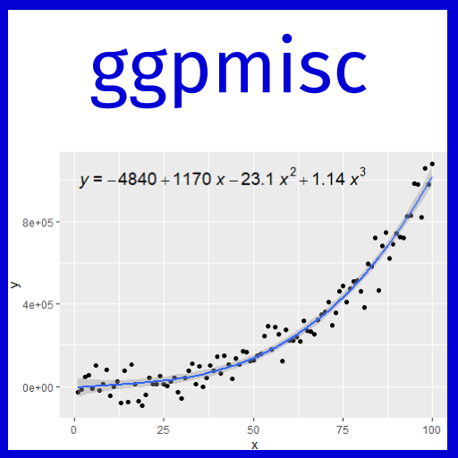
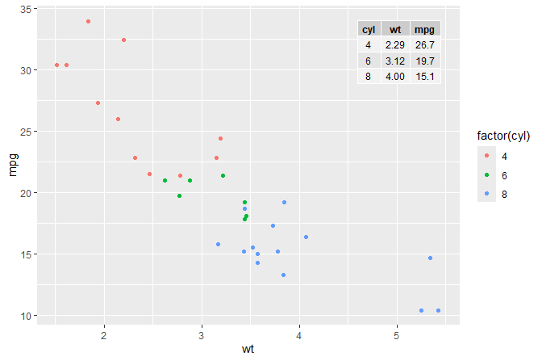
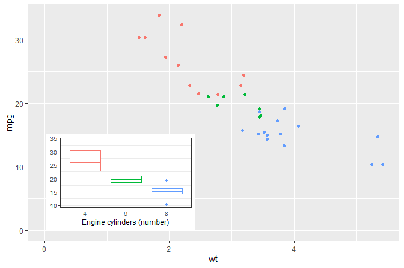
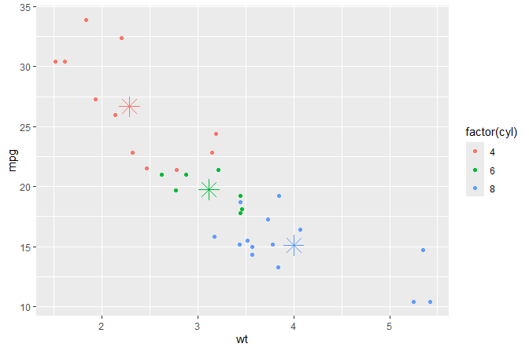
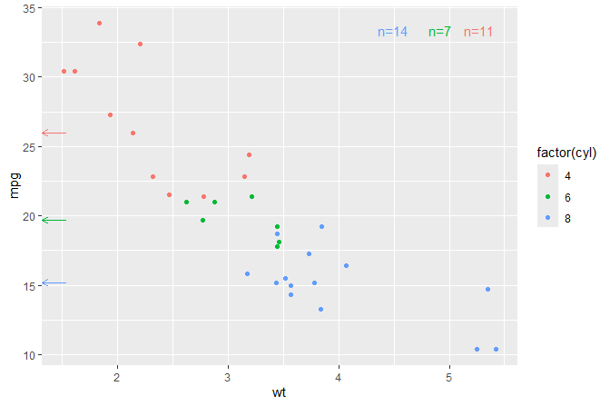
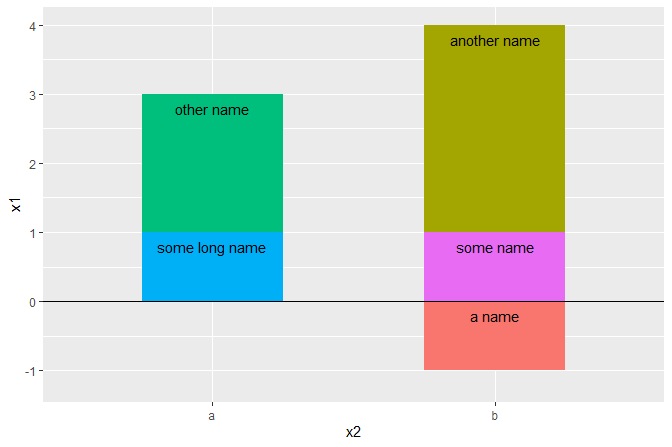

<!-- README.md is generated from README.Rmd. Please edit that file -->

# ggpp 

<!-- badges: start -->

[](https://cran.r-project.org/package=ggpp)
[](https://cran.r-project.org/web/checks/check_results_ggpp.html)
[](https://github.com/aphalo/ggpp/actions/workflows/R-CMD-check.yaml)
<!-- badges: end -->

## Purpose

Package ‘**ggpp**’ provides a set of building blocks that extend the
Grammar of Graphics implemented in package ‘ggplot2’ (\>= 3.0.0). The
extensions enhance the support of data labels and annotations in plots.
New geometries support insets in plots, data labels, marginal marks and
the use of native plot coordinates (npc). Position functions implement
new approaches to nudging usable with any geometry, but especially
useful together with `geom_text_s()` and `geom_label_s()` from this
package and `geom_text_repel()` and `geom_label_repel()` from package
‘ggrepel’ (\>= 0.9.2). See: (<https://ggrepel.slowkow.com>) for
installation instructions and news about releases.

## Extended Grammar of graphics

### Geometries

The distinction between observations or data mapped to *x* and *y*
aesthetics and data labels is that data labels are linked to a the
coordinates of the data, but own location is usually nearby but not
exactly that of the data. In other words the location of a data label in
*x* and *y* coordinates is flexible as long as the link to a data
observation can be inferred. In the case of annotations the location on
the plotting area is arbitrary, dictated by available graphic design
considerations and the requirement of not occluding data observations.
In the table below we list the geometries defined in package ‘ggpp’,
whether they are intended to for data labels, annotations or data, the
aesthetics and pseudo-aesthetic they obey and whether the can connect
the original data position to the displaced position where the data
label is anchored. These requires also a change in the behaviour of
position functions, that we will describe in the next section.

| Geometry                                   | Main use                        | Aesthetics                                                                                                | Segment |
|--------------------------------------------|---------------------------------|-----------------------------------------------------------------------------------------------------------|---------|
| `geom_text_s()`                            | data labels                     | x, y, label, size, family, font face, colour, alpha, group, angle, vjust, hjust                           | yes     |
| `geom_label_s()`                           | data labels                     | x, y, label, size, family, font face, colour, fill, alpha, linewidth, linetype, group, vjust, hjust       | yes     |
| `geom_text_npc()`                          | annotations                     | npcx, npcy, label, size, family, font face, colour, alpha, group, angle, vjust, hjust                     | no      |
| `geom_label_npc()`                         | annotations                     | npcx, npcy, label, size, family, font face, colour, fill, alpha, linewidth, linetype, group, vjust, hjust | no      |
| `geom_point_s()`                           | data labels                     | x, y, size, colour, fill, alpha, shape, stroke, group                                                     | yes     |
| `geom_table()`                             | data labels                     | x, y, label, size, family, font face, colour, alpha, group, angle, vjust, hjust                           | yes     |
| `geom_table_npc()`                         | annotations                     | npcx, npcy, label, size, family, font face, colour, alpha, group, angle, vjust, hjust                     | no      |
| `geom_plot()` , `geom_grob()`              | data labels                     | x, y, label, group, angle, vjust, hjust                                                                   | yes     |
| `geom_plot_npc()` , `geom_grob_npc()`      | annotations                     | npcx, npcy, label, group, vjust, hjust                                                                    | no      |
| `geom_margin_arrow()`                      | data labels, scale labels, data | xintercept, yintercept, label, size, family, font face, colour, alpha, group, vjust, hjust                | no      |
| `geom_margin_point()`                      | data labels, scale labels, data | xintercept, yintercept, label, size, family, font face, colour, alpha, group, vjust, hjust                | no      |
| `geom_margin_grob()`                       | data labels, scale labels, data | xintercept, yintercept, label, size, family, font face, colour, alpha, group, vjust, hjust                | no      |
| `geom_quadrant_lines()` , `geom_vhlines()` | data labels, scale labels, data | xintercept, yintercept, label, size, family, font face, colour, alpha, group, vjust, hjust                | no      |
|                                            |                                 |                                                                                                           |         |

Geometries defined in package ‘ggpp’

## Position functions

In contrast to position functions from ‘ggplot2’ all these position
functions are able keep the original *x* and *y* coordinates under a
different name in the `data` object when displacing them to a new
position. This makes them compatible with `geom_text_s()`,
`geom_label_s()`, `geom_point_s()`, `geom_table()`, `geom_plot()` and
`geom_grob()` from this package. All these geoms can draw segments or
arrows connecting the original positions to the displaced positions.
They remain backwards compatible and can be used in all geometries that
have a `position` formal parameter. This is similar to the approach used
in package ‘ggrepel’ (\<= 0.9.1) but uses a different naming convention
that allows the new position functions to remain backwards compatible
with ‘ggplot2’. Starting from version 0.9.2 the geometries from package
‘ggrepel’ are fully compatible with this new naming convention.

Position functions `position_nudge_keep()`, `position_nudge_to()`,
`position_nudge_center()` and `position_nudge_line()` implement
different flavours of nudging. The last two functions make it possible
to apply nudging that varies automatically according to the relative
position of data points with respect to arbitrary points or lines, or
with respect to a polynomial or smoothing spline fitted on-the-fly to
the the observations.

Position functions `position_stacknudge()`, `position_fillnudge()`,
`position_jitternudge()`, `position_dodgenudge()` and
`position_dodge2nudge()` each combines the roles of two *position*
functions. They make it possible to easily nudge labels in plot layers
that use stacking, dodging or jitter. Functions
`position_jitter_keep()`, `position_stack_keep()`,
`position_fill_keep()`, `position_dodge_keep()`,
`position_dosge2_keep()` behave like the positions from ‘ggplot2’ but
keep in the `data` object the original coordinates.

| Position                  | Main use       | Displacement                    | Most used with              |
|---------------------------|----------------|---------------------------------|-----------------------------|
| `position_nudge_keep()`   | nudge          | x, y (fixed distance)           | data labels                 |
| `position_jitter_keep()`  | jitter         | x, y (random)                   | dot plots                   |
| `position_stack_keep()`   | stack          | vertical (absolute)             | column and bar plots        |
| `position_fill_keep()`    | fill           | vertical (relative, fractional) | column plots                |
| `position_dodge_keep()`   | dodge          | sideways (absolute)             | column and bar plots        |
| `position_dosge2_keep()`  | dodge2         | sideways (absolute)             | box plots                   |
| `position_nudge_to()`     | nudge          | x, y (fixed position)           | data labels                 |
| `position_nudge_center()` | nudge          | x, y (away or towards target)   | data labels                 |
| `position_nudge_line()`   | nudge          | x, y (away or towards target)   | data labels                 |
| `position_stacknudge()`   | stack + nudge  | combined, see above             | data labels in column plots |
| `position_fillnudge()`    | fill + nudge   | combined, see above             | data labels in column plots |
| `position_jitternudge()`  | jitter + nudge | combined, see above             | data labels in dot plots    |
| `position_dodgenudge()`   | dodge + nudge  | combined, see above             | data labels in column plots |
| `position_dodge2nudge()`  | dodge2 + nudge | combined, see above             | data labels in box plots    |

### Aesthetics and scales

Scales `scale_npcx_continuous()` and `scale_npcy_continuous()` and the
corresponding new aesthetics `npcx` and `npcy` make it possible to add
graphic elements and text as nnotations to plots using coordinates
expressed in `npc` units for the location within the plotting area. The
difference to using function `annotate()` is that while annotate is
driven only by constant values and does not support facets, the geoms
that use these pseudo-aesthetics do, opening the door to the easy
addition of a whole range of new annotations within the grammar of
graphics.

### Statistics

Statistic `stat_fmt_tb()` helps with the formatting of tables to be
plotted with `geom_table()`.

Four statistics, `stat_dens2d_filter()`, `stat_dens2d_label()`,
`stat_dens1d_filter()` and `stat_dens1d_label()`, implement tagging or
selective labeling of observations based on the local 2D density of
observations in a panel. Another two statistics,
`stat_dens1d_filter_g()` and `stat_dens1d_filter_g()` compute the
density by group instead of by plot panel. These six statistics are
designed to work well together with `geom_text_repel()` and
`geom_label_repel()` from package ‘ggrepel’ (\>= 0.8.0).

The statistics `stat_apply_panel()` and `stat_apply_group()` are useful
for applying arbitrary functions returning numeric vectors like
`cumsum()`, `cummax()` and `diff()`. Statistics `stat_centroid()` and
`stat_summary_xy()` allow computation of summaries on both *x* and *y*
and passing them to a geom.

The statistics `stat_quadrant_counts()` and `stat_panel_counts()` make
it easy to annotate plots with the number of observations.

## Justification

Justifications `"outward_mean"`, `"inward_mean"`, `"outward_median"` and
`"inward_median"` implement outward and inward justification relative to
the centroid of the data instead of to the center of the $x$ or $y$
scales. Justification outward or inward from an arbitrary origin is also
supported. Justification `"position"` implements justification at the
edge nearest to the original position. This works only together with
position functions that save the original location using the naming
convention implemented in ‘ggpp’, otherwise default justification
falls-back to `"center"`/`"middle"`.

## History

This package is a “spin-off” from package ‘ggpmisc’ containing
extensions to the grammar originally written for use wihtin ‘ggpmisc’.
As ‘ggpmisc’ had grown in size, splitting it into two packages was
necessary to easy development and maintenance and to facilitate imports
into other packages. For the time being, package ‘ggpmisc’ imports and
re-exports all visible definitions from ‘ggpp’.

## Examples

The plots below exemplify some of the things that ‘ggpp’ makes possible
or makes easier to code compared to ‘ggplot’ used on its own. Additional
examples including several combining ‘ggpp’ and ‘ggrepel’ are provided
in the package vignette.

``` r
library(ggpp)
library(ggrepel)
library(dplyr)
```

### Insets

A plot with an inset table.

``` r
mtcars %>%
  group_by(cyl) %>%
  summarize(wt = mean(wt), mpg = mean(mpg)) %>%
  ungroup() %>%
  mutate(wt = sprintf("%.2f", wt),
         mpg = sprintf("%.1f", mpg)) -> tb

df <- tibble(x = 5.45, y = 34, tb = list(tb))

ggplot(mtcars, aes(wt, mpg, colour = factor(cyl))) +
  geom_point() +
  geom_table(data = df, aes(x = x, y = y, label = tb))
```

<!-- -->

A plot with an inset plot.

Inset plot positioned using native plot coordinates (npc) and using
keywords insted of numerical values in the range 0..1 which are also
accepted.

``` r
p <- ggplot(mtcars, aes(factor(cyl), mpg, colour = factor(cyl))) +
  stat_boxplot() +
  labs(y = NULL, x = "Engine cylinders (number)") +
  theme_bw(9) + theme(legend.position = "none")

ggplot(mtcars, aes(wt, mpg, colour = factor(cyl))) +
  geom_point(show.legend = FALSE) +
  annotate("plot_npc", npcx = "left", npcy = "bottom", label = p) +
  expand_limits(y = 0, x = 0)
```

<!-- -->

### Centroids

Means computed on-the-fly and shown as asterisks.

``` r
ggplot(mtcars, aes(wt, mpg, colour = factor(cyl))) +
  geom_point() +
  stat_centroid(shape = "asterisk", size = 6)
```

<!-- -->

Medians computed on-the-fly displayed marginal arrows.

``` r
ggplot(mtcars, aes(wt, mpg, colour = factor(cyl))) +
  geom_point() +
  stat_centroid(geom = "y_margin_arrow", .fun = median,
                aes(yintercept = after_stat(y)), arrow.length = 0.05)
```

<!-- -->

### Nudging and stacking combined

``` r
df <- data.frame(x1 = c(1, 2, 1, 3, -1),
                 x2 = c("a", "a", "b", "b", "b"),
                 grp = c("some long name", "other name", "some name",
                         "another name", "a name"))

# Add labels to a horizontal column plot (stacked by default)
ggplot(data = df, aes(x2, x1, group = grp)) +
  geom_col(aes(fill = grp), width=0.5) +
  geom_hline(yintercept = 0) +
  geom_text(
    aes(label = grp),
    position = position_stacknudge(vjust = 1, y = -0.2)) +
  theme(legend.position = "none")
```

<!-- -->

## Installation

Installation of the most recent stable version from CRAN:

``` r
install.packages("ggpp")
```

Installation of the current unstable version from GitHub:

``` r
# install.packages("devtools")
devtools::install_github("aphalo/ggpp")
```

## Documentation

HTML documentation for the package, including help pages and the *User
Guide*, is available at (<https://docs.r4photobiology.info/ggpp/>).

News about updates are regularly posted at
(<https://www.r4photobiology.info/>).

Chapter 7 in Aphalo (2020) explains both basic concepts of the grammar
of graphics as implemented in ‘ggplot2’ as well as extensions to this
grammar including several of those made available by packages ‘ggpp’ and
‘ggpmisc’.

## Contributing

Please report bugs and request new features at
(<https://github.com/aphalo/ggpp/issues>). Pull requests are welcome at
(<https://github.com/aphalo/ggpp>).

## Citation

If you use this package to produce scientific or commercial
publications, please cite according to:

``` r
citation("ggpp")
```

## Acknowledgements

Being an extension to package ‘ggplot2’, some of the code in package
‘ggpp’ has been created by using as a template that from layer functions
and scales in ‘ggplot2’. The user interface of ‘ggpp’ aims at being as
consistent as possible with ‘ggplot2’ and the layered grammar of
graphics (Wickham 2010). New features added in ‘ggplot2’ are added when
relevant to ‘ggpp’, such as support for `orientation` for flipping of
layers. This package does consequently indirectly include significant
contributions from several of the authors and maintainers of ‘ggplot2’,
listed at (<https://ggplot2.tidyverse.org/>).

Coordination of development through a friendly exchange of ideas and
reciprocal contributions by Kamil Slowikowski to ‘ggpp’ and by myself to
‘ggrepel’ has made the two packages fully inter-compatible.

## References

Aphalo, Pedro J. (2020) *Learn R: As a Language.* The R Series. Boca
Raton and London: Chapman and Hall/CRC Press. ISBN: 978-0-367-18253-3.
350 pp.

Wickham, Hadley. 2010. “A Layered Grammar of Graphics.” Journal of
Computational and Graphical Statistics 19 (1): 3–28.
<https://doi.org/10.1198/jcgs.2009.07098>.

## License

© 2016-2023 Pedro J. Aphalo (<pedro.aphalo@helsinki.fi>). Released under
the GPL, version 2 or greater. This software carries no warranty of any
kind.
